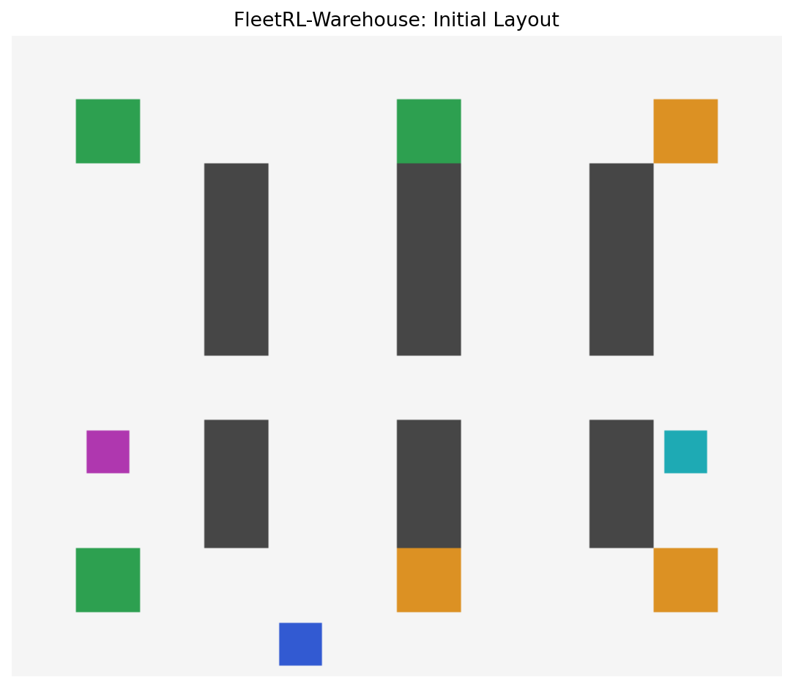
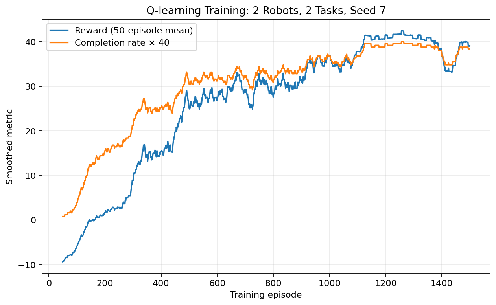

# FleetRL-Warehouse

**Cooperative Multi-Robot Reinforcement Learning for Warehouse Logistics with ROS 2 and Gazebo**

FleetRL-Warehouse is a research-oriented robotics and reinforcement learning project for cooperative warehouse logistics. The project models a fleet of mobile robots that coordinate to collect packages, avoid obstacles and inter-robot collisions, and deliver orders to designated drop-off locations.

The repository provides two complementary execution layers. The first is a lightweight Python simulator for fast reinforcement learning training, benchmarking, and visualization. The second is a ROS 2 and Gazebo integration layer for demonstrating robot middleware, task coordination, policy execution, and independent safety supervision in a robotics-oriented workflow.



## Project Objectives

This repository demonstrates how reinforcement learning can be applied to cooperative multi-robot warehouse logistics. The main objectives are to:

* develop a reproducible multi-robot warehouse simulation environment;
* implement and compare tabular reinforcement learning algorithms such as Q-learning and SARSA;
* integrate deep reinforcement learning methods including PPO, A2C, DDPG, and SAC;
* support both discrete grid-based control and continuous velocity-like control;
* evaluate cooperative task completion, collision behavior, and policy efficiency;
* provide a ROS 2 and Gazebo deployment layer for robotics-oriented experimentation;
* maintain a clean, testable, and extensible project structure suitable for further research and engineering development.

## Key Features

* Cooperative multi-robot warehouse environment
* Package pickup and delivery tasks
* Static shelf and obstacle avoidance
* Inter-robot collision and edge-swap detection
* Shared cooperative reward design
* Independent Q-learning and SARSA implementations from scratch
* PPO and A2C with centralized multi-discrete actions
* DDPG and SAC with continuous velocity-like actions
* Centralized training with decentralized execution
* Reproducible training, evaluation, and benchmarking scripts
* ANSI terminal simulation and visualization tools
* Jupyter Notebook demonstration
* ROS 2 nodes for task coordination, policy execution, and safety supervision
* Gazebo warehouse world and differential-drive robot model
* Unit tests, Docker support, and GitHub Actions workflow

## Execution Paths

The project supports two execution paths.

### Path A: Fast Python Simulator

The Python simulator runs on Windows, macOS, and Linux. It is designed for rapid experimentation, training, benchmarking, and visualization of reinforcement learning algorithms.

Use this path to:

* understand the warehouse environment;
* train Q-learning and SARSA agents;
* train deep RL policies using Stable-Baselines3;
* compare algorithms using reproducible metrics;
* generate plots and benchmark results.

### Path B: ROS 2 and Gazebo Fleet Simulation

The ROS 2 and Gazebo layer is designed for robotics-oriented deployment and middleware demonstration. It is recommended for Ubuntu systems with ROS 2 and Gazebo installed.

Use this path to demonstrate:

* ROS 2 nodes, topics, parameters, and launch files;
* robot namespaces;
* odometry and lidar integration;
* velocity command publication;
* centralized task coordination;
* decentralized policy execution;
* independent safety filtering before commands reach the robot controller.

## Repository Structure

```text
FleetRL_Warehouse/
├── src/fleetrl_warehouse/
│   ├── envs/                 # Core simulator and Gymnasium-compatible wrappers
│   ├── algorithms/           # Q-learning, SARSA, and deep RL training entry points
│   ├── evaluation/           # Metrics and reproducible evaluation utilities
│   └── cli.py                # Command-line interface: `fleetrl`
├── ros2_ws/src/fleetrl_warehouse_ros/
│   ├── fleetrl_warehouse_ros/# ROS 2 nodes
│   ├── launch/               # Fleet launch files
│   ├── worlds/               # Gazebo warehouse world
│   └── models/               # Differential-drive robot model with lidar
├── configs/                  # Experiment and environment configuration
├── notebooks/                # Jupyter Notebook demonstrations
├── scripts/                  # Benchmarking and utility scripts
├── tests/                    # Unit tests
├── docs/                     # Architecture, algorithms, setup, and project notes
├── docker/                   # Docker and container support
└── .github/workflows/        # GitHub Actions workflow
```

## Installation

### Windows with Anaconda

Open an Anaconda Prompt or a terminal inside the extracted project folder.

```bat
conda create -n fleetrl python=3.11 -y
conda activate fleetrl
python -m pip install --upgrade pip
python -m pip install -e .[all]
python -m pytest -v
```

If the installation is successful, the test suite should complete without failures.

## Quick Start

### Run the Warehouse Simulator

Run an obstacle-aware non-learning baseline first:

```bat
fleetrl simulate --robots 2 --tasks 2 --max-steps 100 --delay 0.08
```

This command launches a terminal-based warehouse simulation with two robots and two delivery tasks.

Common symbols in the simulation are:

```text
#  shelf or obstacle
P  pickup station
D  delivery station
0  robot 0
1  robot 1
```

### Train Q-learning

```bat
fleetrl train-tabular --algorithm q_learning --episodes 1500 --robots 2 --tasks 2 --max-steps 100 --output artifacts/q_learning.json --history artifacts/q_learning.csv
```

### Evaluate Q-learning

```bat
fleetrl evaluate --model artifacts/q_learning.json --robots 2 --tasks 2 --max-steps 100
```

### Visualize the Trained Q-learning Policy

```bat
fleetrl simulate --model artifacts/q_learning.json --robots 2 --tasks 2 --max-steps 100 --delay 0.08
```

### Train SARSA

```bat
fleetrl train-tabular --algorithm sarsa --episodes 1500 --robots 2 --tasks 2 --max-steps 100 --output artifacts/sarsa.json --history artifacts/sarsa.csv
```

### Train Deep Reinforcement Learning Policies

```bat
fleetrl train-deep --algorithm ppo --timesteps 100000 --output artifacts/ppo_warehouse
fleetrl train-deep --algorithm a2c --timesteps 100000 --output artifacts/a2c_warehouse
fleetrl train-deep --algorithm ddpg --timesteps 150000 --output artifacts/ddpg_warehouse
fleetrl train-deep --algorithm sac --timesteps 150000 --output artifacts/sac_warehouse
```

PPO and A2C use a centralized `MultiDiscrete` action representation containing one discrete action per robot. DDPG and SAC use a continuous action vector containing velocity-like commands for each robot.

## ROS 2 and Gazebo Quick Start

Recommended platform:

* Ubuntu 24.04
* ROS 2 Jazzy Jalisco
* Gazebo Harmonic

After installing ROS 2, Gazebo, `ros_gz`, and Colcon:

```bash
cd ros2_ws
source /opt/ros/jazzy/setup.bash
rosdep install --from-paths src --ignore-src -r -y
colcon build --symlink-install
source install/setup.bash
ros2 launch fleetrl_warehouse_ros warehouse_fleet.launch.py
```

The launch file starts a simulated multi-robot warehouse fleet, including:

* three robot namespaces;
* a central task coordinator;
* one policy executor per robot;
* one safety supervisor per robot;
* ROS-Gazebo topic bridges;
* warehouse world and mobile robot models.

Detailed setup instructions are available in:

```text
docs/ROS2_UBUNTU_SETUP.md
```

The staged development plan is available in:

```text
docs/PROJECT_PLAN.md
```

## Implemented Algorithms

| Algorithm  |  Action Space | Implementation    | Purpose                                |
| ---------- | ------------: | ----------------- | -------------------------------------- |
| Q-learning |      Discrete | From scratch      | Off-policy tabular baseline            |
| SARSA      |      Discrete | From scratch      | On-policy tabular baseline             |
| PPO        | MultiDiscrete | Stable-Baselines3 | Stable cooperative deep RL baseline    |
| A2C        | MultiDiscrete | Stable-Baselines3 | Actor-critic baseline                  |
| DDPG       |    Continuous | Stable-Baselines3 | Deterministic continuous control       |
| SAC        |    Continuous | Stable-Baselines3 | Entropy-regularized continuous control |

The mathematical formulation of the state representation, action spaces, reward function, and evaluation protocol is described in:

```text
docs/ALGORITHMS.md
```

## Sample Results

A deterministic CPU run with seed 7, two robots, two tasks, 1,500 Q-learning episodes, and 20 evaluation episodes produced:

* Mean completion rate: 0.80
* Mean collisions: 0.05 per episode
* Mean episode steps: 59.3
* Mean reward: 31.671

These results are provided as a reproducible sample for the included small benchmark. They are not intended as universal performance claims across all random seeds, warehouse sizes, or task configurations.



## Q-learning and SARSA Comparison

In a two-robot, two-task warehouse benchmark, the final 100 training episodes produced the following comparison:

| Algorithm  | Mean Reward | Mean Completion Rate | Mean Collisions | Mean Steps |
| ---------- | ----------: | -------------------: | --------------: | ---------: |
| Q-learning |     37.2296 |                 0.93 |            0.12 |      57.88 |
| SARSA      |     39.8599 |                 0.95 |            0.05 |      48.05 |

In this run, SARSA achieved a slightly higher completion rate, fewer collision attempts, fewer average steps, and a higher final reward. This is consistent with SARSA’s on-policy learning behavior, which can produce more cautious policies in environments where unsafe movements are penalized.

## Safety Design

The ROS 2 deployment layer separates policy execution from safety supervision. The learned policy produces a proposed command, while a dedicated safety supervisor independently monitors lidar data and can suppress unsafe forward motion before the command reaches the simulated robot controller.

This separation is intentional: safety supervision should not depend entirely on the learned policy.

## Testing

Run the test suite with:

```bash
python -m pytest -v
```

The lightweight unit tests cover:

* deterministic environment resets;
* collision blocking;
* pickup and delivery transitions;
* observation dimensions;
* Q-learning and SARSA updates;
* model serialization;
* rendering behavior;
* end-to-end delivery demonstration.

GitHub Actions can be used to run the Python test suite automatically whenever code is pushed to the repository.

## Limitations

* The fast simulator uses grid-based dynamics rather than full rigid-body physics.
* The ROS 2 policy adapter discretizes Gazebo positions into warehouse grid cells.
* Deep RL models require additional training time and are not bundled as universal pretrained policies.
* The ROS 2 and Gazebo launch files require testing on an Ubuntu system with the correct robotics stack installed.
* Continuous-control policies in the lightweight simulator approximate velocity-like commands rather than modeling all low-level robot dynamics.

## Recommended Use

This repository is intended for reinforcement learning, multi-agent coordination, and robotics experimentation. It can be used to study:

* cooperative reward design;
* tabular versus deep reinforcement learning;
* discrete versus continuous control;
* centralized training and decentralized execution;
* safe command filtering in mobile robot fleets;
* warehouse logistics as a multi-agent decision-making problem.

## License

This project is released under the MIT License.


