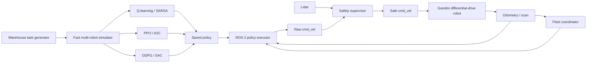

# System Architecture

## Design objective

The system separates fast reinforcement-learning experimentation from realistic robotics deployment. Training millions of steps directly in Gazebo is slow; therefore the policy is first trained in a deterministic NumPy/Gymnasium environment and then transferred through a ROS 2 adapter.

## Fast simulation layer

`WarehouseCore` models:

- simultaneous actions for all robots;
- shelves and free aisles;
- pickup and delivery stations;
- task assignment and carrying state;
- vertex collisions and edge swaps;
- team reward and episode metrics;
- ANSI and RGB rendering.

The core depends only on NumPy. This keeps unit tests fast and makes the project accessible to beginners.

## Learning layer

### Tabular decentralized learners

Each robot has its own Q-table and receives a compact local observation. All robots receive the shared team reward. This is independent learning with cooperative reward sharing.

### Deep centralized learner

The Gymnasium wrapper exposes a centralized global observation. PPO/A2C output one discrete action per robot. DDPG/SAC output two continuous values per robot. At deployment, each action component is executed by its corresponding robot.

## ROS 2 layer

- `fleet_coordinator`: tracks robot odometry, greedily assigns waiting tasks, updates pickup/delivery state, and publishes `/fleet/state`.
- `policy_executor`: loads a Q-table when provided, discretizes ROS poses, produces high-level actions, and publishes `cmd_vel_raw`.
- `safety_supervisor`: reads lidar, filters unsafe forward commands, and publishes final `cmd_vel`.
- `ros_gz_bridge`: connects ROS 2 message topics to Gazebo Transport.

## Main ROS topics

| Topic | Type | Purpose |
|---|---|---|
| `/fleet/state` | `std_msgs/String` | JSON fleet/task state for a compact demo interface |
| `/fleet/interactions` | `std_msgs/String` | Pickup/drop interaction events |
| `/robot_i/odom` | `nav_msgs/Odometry` | Robot pose and velocity |
| `/robot_i/scan` | `sensor_msgs/LaserScan` | Collision-safety input |
| `/robot_i/cmd_vel_raw` | `geometry_msgs/Twist` | Unfiltered policy command |
| `/robot_i/cmd_vel` | `geometry_msgs/Twist` | Safety-filtered drive command |

## Centralized training, decentralized execution

The shared observation and reward improve coordination during training. At runtime, each robot has a separate executor and safety supervisor. The coordinator only supplies task-level shared state.
